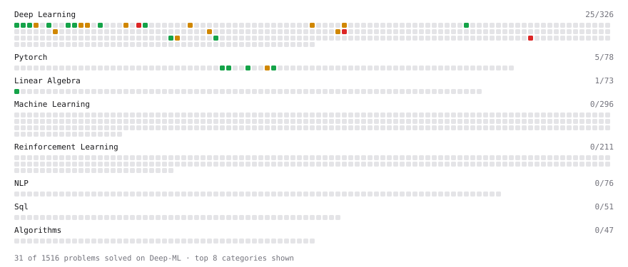

# Deep-ML

My machine learning practice from [Deep-ML](https://www.deep-ml.com). Every solution here was written by hand.

**31** solved · 31 problems · 0 labs · 0 math

[**Browse the interactive portfolio**](https://Haoyan-collab.github.io/deep-ml/) to replay this filling in over time.

## Problems

| | Difficulty | Solved | |
| --- | --- | --- | --- |
| [Apply Dropout to Attention Weights](https://www.deep-ml.com/problems/956) | easy | 2026-10-04 | [solution](problems/0956-apply-dropout-to-attention-weights) |
| [Create and Inspect a Tensor](https://www.deep-ml.com/problems/1220) | easy | 2026-10-07 | [solution](problems/1220-create-and-inspect-a-tensor) |
| [Implement Binary Cross-Entropy Loss](https://www.deep-ml.com/problems/263) | easy | 2026-09-30 | [solution](problems/0263-implement-binary-cross-entropy-loss) |
| [Implement ReLU Activation Function](https://www.deep-ml.com/problems/42) | easy | 2026-09-30 | [solution](problems/0042-implement-relu-activation-function) |
| [Implement the Hard Sigmoid Activation Function](https://www.deep-ml.com/problems/96) | easy | 2026-10-04 | [solution](problems/0096-implement-the-hard-sigmoid-activation-function) |
| [Implementation of Log Softmax Function](https://www.deep-ml.com/problems/39) | easy | 2026-09-30 | [solution](problems/0039-implementation-of-log-softmax-function) |
| [KL Divergence Between Two Normal Distributions](https://www.deep-ml.com/problems/56) | easy | 2026-09-30 | [solution](problems/0056-kl-divergence-between-two-normal-distributions) |
| [Leaky ReLU Activation Function](https://www.deep-ml.com/problems/44) | easy | 2026-09-30 | [solution](problems/0044-leaky-relu-activation-function) |
| [Matrix-Vector Dot Product](https://www.deep-ml.com/problems/1) | easy | 2026-10-07 | [solution](problems/0001-matrix-vector-dot-product) |
| [Mean Squared Error from Scratch](https://www.deep-ml.com/problems/1228) | easy | 2026-10-02 | [solution](problems/1228-mean-squared-error-from-scratch) |
| [Reshape and Transpose a Tensor](https://www.deep-ml.com/problems/1221) | easy | 2026-10-07 | [solution](problems/1221-reshape-and-transpose-a-tensor) |
| [Scale Attention Scores by sqrt(d_k)](https://www.deep-ml.com/problems/963) | easy | 2026-10-04 | [solution](problems/0963-scale-attention-scores-by-sqrt-d-k) |
| [Sigmoid Activation Function Understanding](https://www.deep-ml.com/problems/22) | easy | 2026-09-30 | [solution](problems/0022-sigmoid-activation-function-understanding) |
| [Single Linear Neuron Forward](https://www.deep-ml.com/problems/1224) | easy | 2026-10-07 | [solution](problems/1224-single-linear-neuron-forward) |
| [Single Neuron](https://www.deep-ml.com/problems/24) | easy | 2026-09-30 | [solution](problems/0024-single-neuron) |
| [Softmax Activation Function Implementation ](https://www.deep-ml.com/problems/23) | easy | 2026-09-30 | [solution](problems/0023-softmax-activation-function-implementation) |
| [Adam Optimizer](https://www.deep-ml.com/problems/87) | medium | 2026-10-03 | [solution](problems/0087-adam-optimizer) |
| [Build Scaled Dot-Product Attention](https://www.deep-ml.com/problems/490) | medium | 2026-10-01 | [solution](problems/0490-build-scaled-dot-product-attention) |
| [Dropout Layer](https://www.deep-ml.com/problems/151) | medium | 2026-10-05 | [solution](problems/0151-dropout-layer) |
| [Implement Adam Optimization Algorithm](https://www.deep-ml.com/problems/49) | medium | 2026-10-02 | [solution](problems/0049-implement-adam-optimization-algorithm) |
| [Implement Batched Causal Self-Attention](https://www.deep-ml.com/problems/957) | medium | 2026-10-04 | [solution](problems/0957-implement-batched-causal-self-attention) |
| [Implement Masked Self-Attention](https://www.deep-ml.com/problems/107) | medium | 2026-10-02 | [solution](problems/0107-implement-masked-self-attention) |
| [Implement Position-wise Feed-Forward Block with Residual and Dropout](https://www.deep-ml.com/problems/178) | medium | 2026-10-04 | [solution](problems/0178-implement-position-wise-feed-forward-block-with-residual-and-dropout) |
| [Implement Self-Attention Mechanism](https://www.deep-ml.com/problems/53) | medium | 2026-10-01 | [solution](problems/0053-implement-self-attention-mechanism) |
| [KV Cache for Efficient Autoregressive Attention](https://www.deep-ml.com/problems/376) | medium | 2026-10-04 | [solution](problems/0376-kv-cache-for-efficient-autoregressive-attention) |
| [Numerically Stable Softmax](https://www.deep-ml.com/problems/1227) | medium | 2026-10-07 | [solution](problems/1227-numerically-stable-softmax) |
| [Pre-Norm vs Post-Norm Transformer Block](https://www.deep-ml.com/problems/408) | medium | 2026-10-05 | [solution](problems/0408-pre-norm-vs-post-norm-transformer-block) |
| [Single Neuron with Backpropagation](https://www.deep-ml.com/problems/25) | medium | 2026-10-01 | [solution](problems/0025-single-neuron-with-backpropagation) |
| [Build a Transformer Encoder Layer](https://www.deep-ml.com/problems/491) | hard | 2026-10-05 | [solution](problems/0491-build-a-transformer-encoder-layer) |
| [Implement Multi-Head Attention](https://www.deep-ml.com/problems/94) | hard | 2026-10-03 | [solution](problems/0094-implement-multi-head-attention) |
| [Pre-Norm GPT Transformer Block Forward Pass](https://www.deep-ml.com/problems/1056) | hard | 2026-10-04 | [solution](problems/1056-pre-norm-gpt-transformer-block-forward-pass) |

---

_This file is regenerated by Deep-ML on every push._
